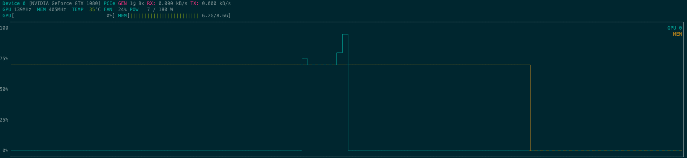

# Alakazam
Tests with LLMs


## App
```
streamlit run app.py
```

## HW
* Nvidia GTX 1080 - 8 GB memory - The red pajama model stays around 6 GB without needing to load the model at 8 bit (the library is not compatible with my GPU anyways)



Sometimes you are the lucky one getting a ```torch.cuda.OutOfMemoryError: CUDA out of memory```.